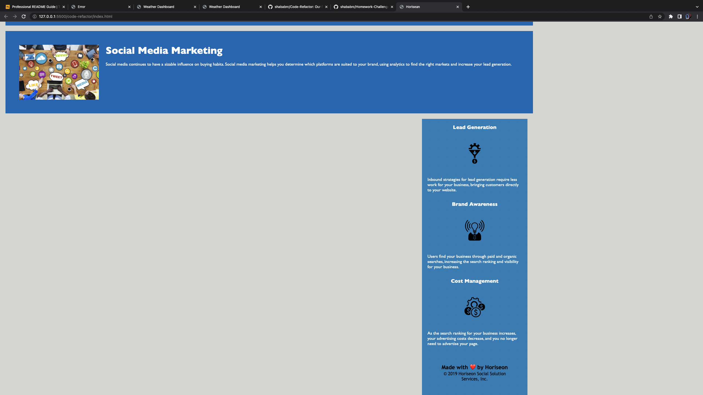

# Code Refactor

## Description

Our motivation was to build an application that shows how to optimize search engine, social media marketing, and online reputation marketing, by restructuring css and html elements
to match semantics. 


## USER STORY
```md
AS A marketing agency
I WANT a codebase that follows accessibility standards
SO THAT our own site is optimized for search engines
```

The website is finished when the various requirements are fulfilled:

## ACCEPTANCE CRITERIA
```md
GIVEN a webpage meets accessibility standards
WHEN I view the source code
THEN I find semantic HTML elements
WHEN I view the structure of the HTML elements
THEN I find that the elements follow a logical structure independent of styling and positioning
WHEN I view the image elements
THEN I find accessible alt attributes
WHEN I view the heading attributes
THEN they fall in sequential order
WHEN I view the title element
THEN I find a concise, descriptive title
```


## How we accomplished this:

## By: 

### in HTML:
        HTML Refactoring into Semantic
        Header classes were changed into Header tags.
        HTML Semantic structure was added into the document.
        Fixed issue with top link not working.
        We changed most of the div tags to either nav or sections.

 
 
 

### in CSS:
            We restructure/refactor the classes order by reordering elements as such:
            body, .header h1 .seo
            a
            p
            .float-left
            .float-right
            .hero
            .content
            .search-engine-optimization, .online-reputation-management,
            .social-media-marketing,
            .benefits
            .benefit-lead, .benefit brand, .benefit-cost
            footer
            /* Header Style  */
            .header h1
            .header div
            .header div ul
            .header div ul li
            a
            p
            .benefit-lead h3, .benefit-brand h3, .benefit-cost h3

            .benefit-lead img, benefit-brand img, benefit-cost img

            .search-engine-optimization h2, .online-reputation-management h2, .social-media-marketing h2
            .footer h2


## Completed Application Screenshots



## Link to Github Repo:
https://github.com/shababrc/Code-Refactor

## Link to Deployed Site:


## Credits
Credits to the rest of the ucla bootcamp class for help on this assignment. Credit to Bryan and Shawn from the teaching staff. 

## License
MIT

